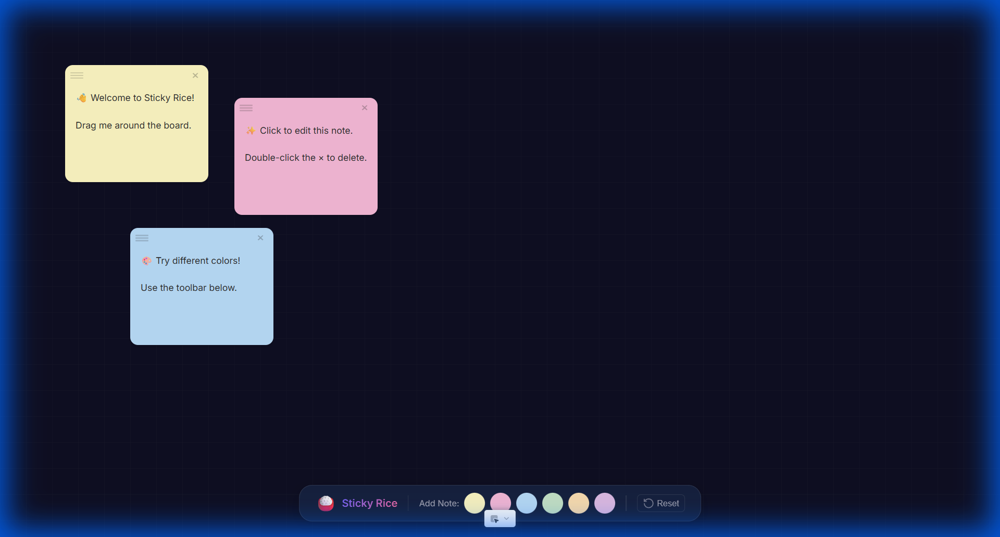

# ⚡ SATSET

Aplikasi produktivitas buat lo yang anti lelet. Visual sticky notes dengan gaya Gen Z.



## ✨ Features

- 🎨 **Colorful Sticky Notes** - Yellow, Pink, Blue, Green, Orange, Purple
- 🖱️ **Drag & Drop** - Reposition notes anywhere on the canvas
- ✏️ **Inline Editing** - Click to edit note content directly
- 🗑️ **Quick Delete** - Remove notes with the × button
- 💾 **Auto-Save** - Notes persist in LocalStorage
- 🌙 **Dark Theme** - Beautiful dark canvas with subtle grid pattern
- 📱 **Responsive** - Works on desktop and mobile

## 🚀 Quick Start

```bash
# Clone the repository
git clone https://github.com/muhamadbasim/sticky-rice-clone.git
cd sticky-rice-clone

# Install dependencies
npm install

# Start development server
npm run dev
```

Open [http://localhost:5173](http://localhost:5173) in your browser.

## 🛠️ Tech Stack

| Technology | Purpose |
|------------|---------|
| [Svelte 5](https://svelte.dev/) | UI Framework with Runes |
| [Vite](https://vitejs.dev/) | Build tool & Dev server |
| Vanilla CSS | Styling with CSS Variables |
| LocalStorage | Data persistence |

## 📁 Project Structure

```
src/
├── App.svelte                 # Main app component
├── app.css                    # Global styles & design system
├── main.js                    # Entry point
└── lib/
    ├── components/
    │   ├── Canvas.svelte      # Main board with grid background
    │   ├── StickyNote.svelte  # Draggable note component
    │   └── Toolbar.svelte     # Bottom action bar
    └── stores/
        └── boardStore.js      # State management + LocalStorage
```

## 🎯 How It Works

### Adding Notes

Click any color button in the toolbar to add a new sticky note of that color.

### Moving Notes

Click and drag a note by its header (top area with lines) to reposition it.

### Editing Notes

Click on the note body to start typing. Changes are saved automatically.

### Deleting Notes

Click the × button in the top-right corner of any note.

## 🔧 Available Scripts

| Command | Description |
|---------|-------------|
| `npm run dev` | Start development server |
| `npm run build` | Build for production |
| `npm run preview` | Preview production build |

## 📸 Screenshots

### Main Interface

Dark canvas with colorful sticky notes and floating toolbar.

### Toolbar

Bottom bar featuring the Sticky Rice brand, color picker buttons, and reset action.

## 🤝 Contributing

1. Fork the repository
2. Create your feature branch (`git checkout -b feature/amazing-feature`)
3. Commit your changes (`git commit -m 'Add some amazing feature'`)
4. Push to the branch (`git push origin feature/amazing-feature`)
5. Open a Pull Request

## 📄 License

This project is open source and available under the [MIT License](LICENSE).

## 🙏 Acknowledgements

- Inspired by [Sticky Rice App](https://stickyriceapp.com/)
- Built with [Svelte](https://svelte.dev/) and [Vite](https://vitejs.dev/)
